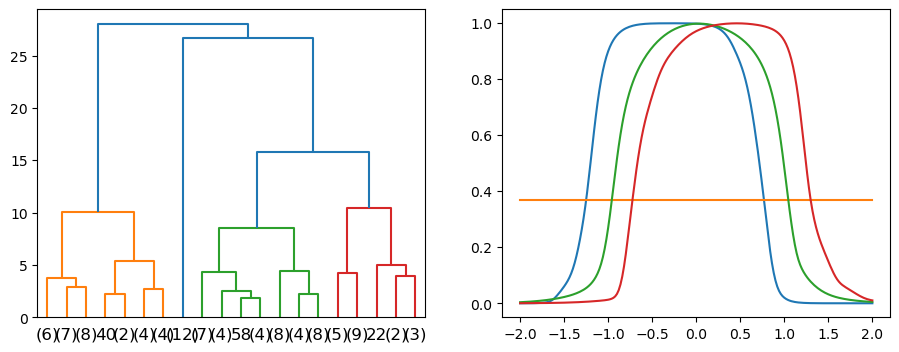

```python
import numpy as np
import matplotlib.pyplot as plt
import matplotlib
import scipy.cluster.hierarchy as shc
import dendro
```


```python
### Make some fake data. 100 total curves:
x = np.linspace(-2,2,201)
np.random.seed(12345)
dat = np.exp(-(x-np.random.randn(100,1)/4)**(2*np.floor(10*np.random.random([100,1]))))
plt.plot(x,dat.T);
```


    

    


## First, let's look at the 'default' dendrogram and the reconstructed signals that come from it


```python
### Try assigning n=4 clusters
n = 4

plt.figure(figsize=(11,4))

plt.subplot(1,2,1)
Z = shc.linkage(dat, method = 'ward')
dend = shc.dendrogram(Z, 
            orientation='top', 
            truncate_mode='lastp',
            color_threshold=12,
            p=20)

plt.subplot(1,2,2)
clus = shc.fcluster(Z,n,criterion='maxclust')-1  ### -1 as default counting starts at 1. Impractical in python

for i in range(n):
    plt.plot(x,dat[clus==i].mean(axis=0))
```


    

    


## This Dendrogram and reconstructed data aren't great, as:
1. The labels on the x axis have limited meaning
2. No indication of where the cutoff is visually 
3. Speaking of colours -- the colours from the dendrogram don't match the ccluster means (The horizontal line cluster should be blue, not orange)
4. You have to manually pick both the number of clusters and corresponding cutoff

## Example workflow:
Here's an example of how we might use dendro. First, run the code specifying only the number of clusters until you get a number that is reasonable. We'll start this exercise without plotting any cluster means.


```python
### Trying with 8 clusters

n_clust = 8
n_leaves = 40 ### pick something that makes it look good!


fig, ax = plt.subplots(1,1,figsize=(13,4))

### plot dendrogram
ax, clus = dendro.improved_dendrogram(ax, dat, n_clust, n_leaves = n_leaves)

```


    

    


It seems 8 clusters is too many. After some iterating, let's imagine that we decided that 4 was a better number, Additionally, we've experimented with the clusters and decided on names that we like for them, given in the `labels` list. We also decided that we want to use four specific colours, and not use default colors from a colormap. These are given in `colors`. Additionally, we're also going to show the cluster means beside this dendrogram so we can see what each cluster looks like (and be certain that our cluster names are reasonable!)


```python
n_clust = 4
colors = ['#8FC93A','#E4CC37','#E18335','#1E91D6']
labels = ['Gaussian','Square-ish','Skewed','Flat']


fig, ax = plt.subplots(1,2,figsize=(11,4))


ax[0], clus = dendro.improved_dendrogram(ax[0], dat, n_clust, c_list = colors, cluster_names = labels)

for i in range(n_clust):
    ax[1].plot(x,dat[clus==i].mean(axis=0),c=colors[i])
ax[1].legend(labels)
```


    <matplotlib.legend.Legend at 0x11b8c92e0>


    

    


```python

```
